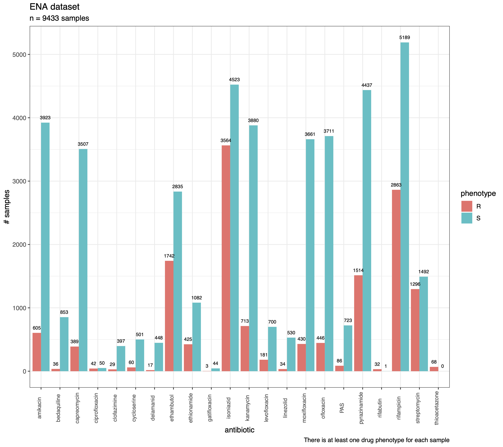
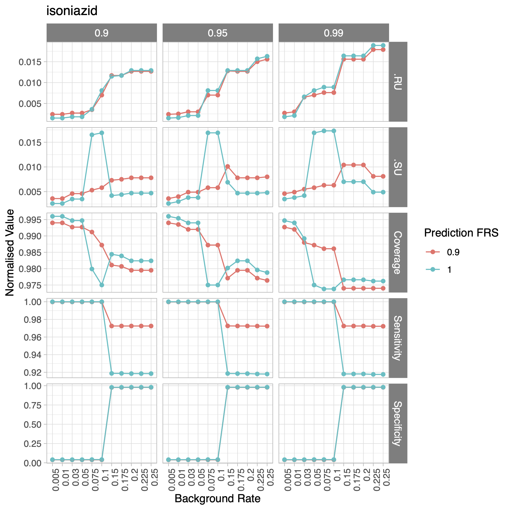
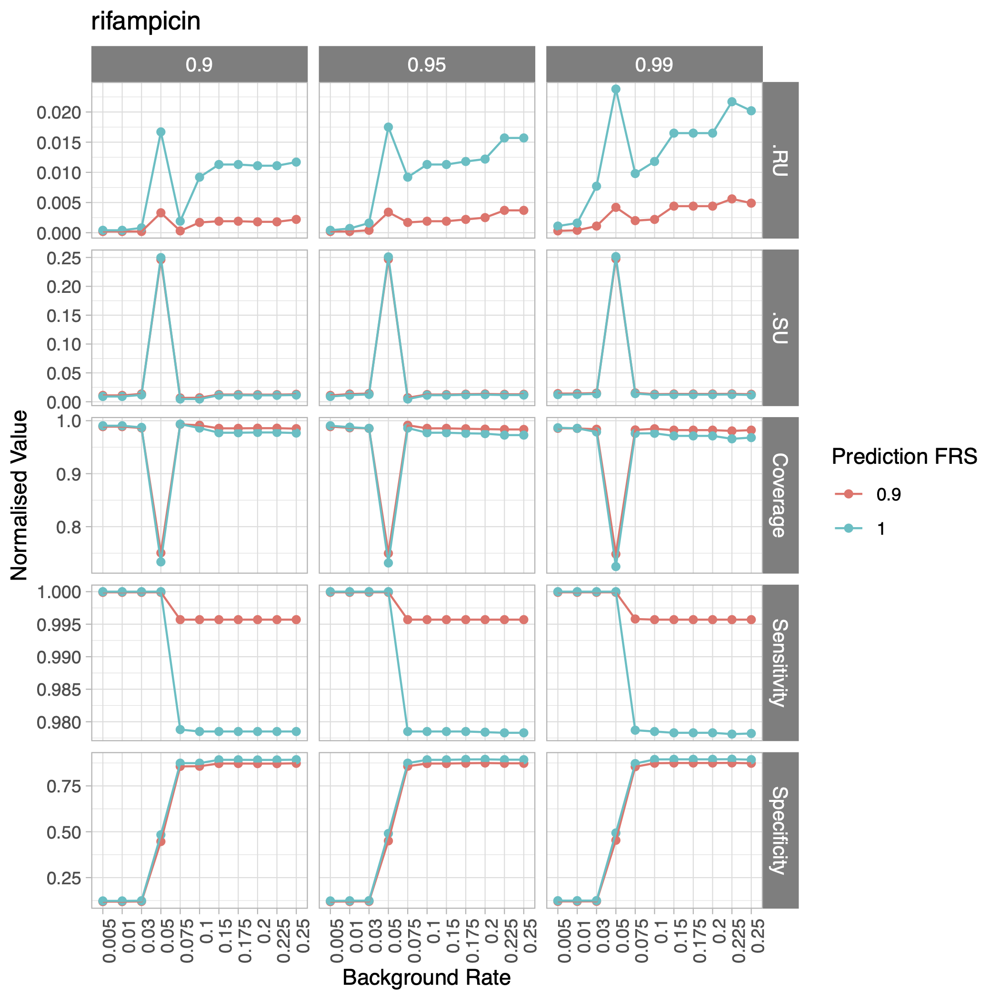
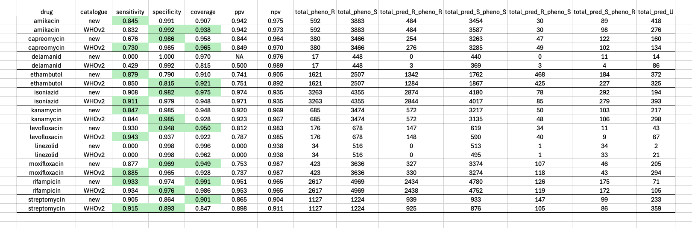
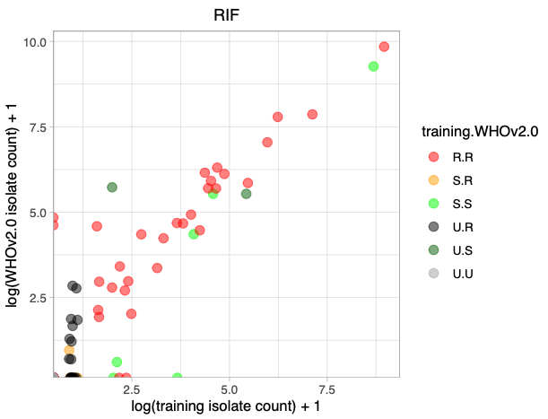

# Analysis Overview
See `results` folder for the main data files, results, graphs and tables referred to in the text below (these will also be hyperlinked).  

Extra scripts and analysis notebooks relevant to each section will be linked in-text to their location in the repo but *not* copied to `results` folder.  

### Generation of training and validation datasets  
Please see [this html document](creating_training_validation_sets/drprg-data-summary.html) for a detailed overview of how the training and validation datasets were constructed. A brief top level summary follows below.

#### Training
Training data: 25033 samples, file = [training_data_20231122.tsv](results/training_data_20231122.tsv)  
Analysis file:  [creating_training_validation_datasets.Rmd](creating_training_validation_sets/creating_training_validation_datasets.Rmd)

The training data was generated from CRyPTIC data ([CRyPTIC_reuse_table_20231208.csv](https://ftp.ebi.ac.uk/pub/databases/cryptic/release_june2022/reuse/CRyPTIC_reuse_table_20231208.csv)) and mykrobe data ([mykrobe.20231121.tsv](creating_training_validation_sets/mykrobe.20231121.tsv)). 501 samples removed due to duplication between these two datasets and/or the validation set (see [here](creating_training_validation_sets/training_data_samples_excluded_duplicated_20231122.tsv) for those).

The training set phenotypes can be seen in the barplot below. Note that there is at least one drug phenotype for each sample.   

---  
  
---

#### Validation  
Validation data: 8914 samples, file = [validation_set_20231110.pass.tsv](creating_training_validation_sets/validation_set_20231110.pass.tsv)    
Analysis file:  [creating_training_validation_datasets.Rmd](creating_training_validation_sets/creating_training_validation_datasets.Rmd)

The validation set came from a curated a dataset of ~45k samples that includes samples used to train the WHO catalogue (n = 35.5k samples) and extra samples from publications/ENA (n = 9.5k samples). These were collected for the DrPRG publication by Hall _et al._ https://github.com/mbhall88/drprg.  

The samples have been phenotyped in various ways (MGIT, plates, proportional agar tests) and binary R/S phenotypes are reported.
As our goal is to compare the herein newly created CRyPTIC catalogue to the WHO catalogue, we excluded samples used to train the WHO catalogue from our validation set. Therefore, our validation dataset is represented by the 9.5k samples scraped from publications/ENA.  
The table below represents the sources (n = 19) of the validation samples. You can see in the table that the majority of samples were phenotyped with MGIT (where phenotype method is stated):  

  

---
 
The validation set phenotypes are plotted below: (Note this data is sometimes referred to as the "ENA dataset" as the samples were sourced externally to CRyPTIC).   

---  
    
---  

### Catalogue construction
#### Variant calling
The test and validation data was downloaded using the ENA accessions and processed using Clockwork `variant_call` and `regenotype`. FRS == 0.9 was chosen by default.
(see [Clockwork wiki](https://github.com/iqbal-lab-org/clockwork/wiki) for more).  

For regenotyping, the following is an example of the run script:  

    nextflow run ../minos/nextflow/regenotype.nf \
        -with-singularity minos_v0.12.5.img \
        -work-dir tmp/regeno \
        -ansi-log false \
        -c ../minos/nextflow/regenotype.config \
        -with-trace nf.trace.txt \
        -profile large \
        --ref_fasta Ref.H37Rv/ref.fa \
        --manifest manifest.tsv \
        --outdir  Out

`manifest.tsv` is a tab-separated file with header:  
name: ENA_IDs/unique sample identifier   
reads: path to per-sample bam file generated by clockwork `variant_call`   
vcf: path to per-sample VCF file generated by clockwork `variant_call`

### Variant table preparation
Variant tables: 16 files in `data/training` with filenames beginning with "MUTATIONS".  

Gnomonicus was used to generate the input mutations table for catalogue construction using default parameters, the regenotyped VCFs and **no** input catalogue.  

The regenotyped VCFs were filtered beforehand to remove ./. and 0/0 containing records to reduce RAM and run time to ~3GB per sample, 25min runtime.  

The resulting `x.variants.csv` and `x.mutations.csv` were processed afterwards whereby
the FRS data from the `x.variants.csv` file was appended to the `x.mutations.csv` file for each sample. See `make_cat_builder_input.py` for this process.  

This produced `MUTATIONS_training_20240125.csv.gz`. This file is 2G and available for request from Kerri/Zam.  

`MUTATIONS_training_20240125.csv.gz` was filtered for variants within a specified set of resistance genes. The file [get_gene_panel_20240125.Rmd](data/get_gene_panel_20240125.Rmd) generated this set from [variant_to_resistance_drug-202206.json](data/variant_to_resistance_drug-202206.json), the panel available from the mykrobe publication
(https://www.ncbi.nlm.nih.gov/pmc/articles/PMC7004237/
https://figshare.com/articles/dataset/panel_final_tsv/7605395/1). This generated [this panel](data/gene_panel_20240125.tsv) for parsing `MUTATIONS_training_20240125.csv.gz`, also see below for table. The resulting 16 input files for catalogue construction in `data/training` with filenames beginning with "MUTATIONS".  

---

##### Resistance gene panel used for catalogue construction  
| Drug          | Gene                              |
|---------------|-----------------------------------|
| Amikacin      | _eis, rrs_                          |
| Capreomycin   | _rrs, tlyA_                         |
| Ciprofloxacin | _gyrA_                              |
| Delamanid     | _ddn_                               |
| Ethambutol    | _embA, embB_                        |
| Ethionamide   | _ethA, fabG1, inhA_                 |
| Isoniazid     | _ahpC, fabG1, inhA, katG_           |
| Kanamycin     | _eis, rrs_                          |
| Levofloxacin  | _gyrA, gyrB_                        |
| Linezolid     | _rplC_                              |
| Moxifloxacin  | _gyrA, gyrB_                        |
| Ofloxacin     | _gyrA_                              |
| Pyrazinamide  | _pncA_                              |
| Rifampicin    | _rpoB_                              |
| Streptomycin  | _gid, rpsL, rrs_                    |

---
### Catalogue generation
Catalogue file: [training_catalogue_1.1_202406.csv](results/training_catalogue_1.1_202406.csv)  
script: [main.py](main.py)  
Parameter grid search: [stats_inspection.Rmd](data/training/results/catomatic_training/stats_inspection.Rmd)

The catalogue construction method evolved over time. The data in this repo is the result of employing `catomatic` to generate per drug catalogues. See `main.py` for the overall pipeline.  Natural mutations and wildcard rules were used during construction, see files [natural_variants.json](data/natural_variants.json) and [wildcards.json](data/wildcards.json).  

Samples with drug phenotype QUALITY == LOW were excluded from the relevant catalogue construction.    

Binomial testing was selected for the statistical analysis. An experiment was run to choose the best background and CI values for catalogue construction:  
1. For each drug, construct a catalogue using the training dataset and Binomial test and a combination of:  

	background = [0.005, 0.01, 0.03, 0.05, 0.07, 0.1, 0.15, 0.175, 0.2, 0.225, 0.25]  
  CI = [0.9, 0.95, 0.99]  

2. Then, run prediction (using piezo, see `main.py`) using each of the catalogues generated with the different parameter pairings and the training data

3. Choose the best parameters for each drug catalogue construction using a grid search with custom scoring that prioritises sensitivity, specificity and coverage* in that order (*U predictions for samples that have phenotype R or S).

The parameters chosen for each drug can be found in [chosen_parameters_all_drugs.csv](data/training/results/catomatic_training/chosen_parameters_all_drugs.csv).  

Below is a graphical representation of the results for isoniazid and rifampicin (all drug results can be found [here](data/training/results/catomatic_training/prediction_stats_all.pdf)). The chosen background rates and CIs for these two drugs are: 0.15, 0.95 and 0.075, 0.99 respectively.  

-----  

_The x axes represents the different background rates used to construct the RIF and INH catalogues and each vertical grouping represents the different CI values used (0.9, 0.95, 0.99). The y axes are normalised values for each of the horizontal experimental readouts of resistance prediction using each experimental catalogue of (from bottom) specificity, sensitivity, coverage, .SU (samples with S phenotype and U genotype prediction), .RU (samples with R phenotype and U genotype prediction). Optimal parameters were chosen using a custom scoring that prioritises sensitivity, specificity and coverage in that order._  

---
The table below outlines the number of classifying entries / rows per drug in the training catalogue. Note that one row does not equal one variant as wildcard rules (for _e.g._ indels, frameshifts) are present.

| Drug         | R   | S   | U   | Total |
|--------------|-----|-----|-----|-------|
| amikacin     | 8   | 218 | 18  | 244   |
| capreomycin  | 3   | 39  | 13  | 55    |
| delamanid    | 13  | 32  | 7   | 52    |
| ethambutol   | 19  | 568 | 64  | 651   |
| ethionamide  | 38  | 225 | 123 | 386   |
| isoniazid    | 48  | 278 | 164 | 490   |
| kanamycin    | 12  | 204 | 18  | 234   |
| levofloxacin | 15  | 248 | 42  | 305   |
| linezolid    | 1   | 20  | 5   | 26    |
| moxifloxacin | 20  | 236 | 29  | 285   |
| ofloxacin    | 12  | 50  | 6   | 68    |
| rifampicin   | 175 | 153 | 90  | 418   |
| streptomycin | 24  | 157 | 63  | 244   |

### Training set evaluation
Analysis notebook: [compare_stats_3cats.Rmd](data/training/results/compare_stats_3cats.Rmd)  

New catalogue predictions using training data results folder:`data/training/results/catomatic_training` , files ending in "predictions.csv" in each relevant drug subdirectory. Cross-reference with [chosen_parameters_all_drugs.csv](data/training/results/catomatic_training/chosen_parameters_all_drugs.csv) for relevant files.  

WHOv2 prediction using training data results folder: `data/training/results/WHOv2`, files ending in "predictions.csv" in each relevant drug subdirectory.  

---

### --- A note on WHO catalogues  
Several versions of both the first (WHOv1) and the second (WHOv2) catalogues were used along the analytical path of this project. The version used for the results presented is the WHOv2 catalogue
[NC_000962.3_WHO-UCN-TB-2023.5_v2.0_GARC1_RFUS.csv](data/NC_000962.3_WHO-UCN-TB-2023.5_v2.0_GARC1_RFUS.csv), found [here](https://github.com/oxfordmmm/tuberculosis_amr_catalogues/blob/public/catalogues/NC_000962.3/NC_000962.3_WHO-UCN-TB-2023.5_v2.0_GARC1_RFUS.csv).  
This repo contains scripts and results for comparing WHO catalogues to any given catalogue in a sane format, see [compare_WHO_custom_catalogue.ipynb](data/compare_WHO_custom_catalogue.ipynb) for more on this.  

---
The resulting training catalogue was evaluated using the training data and compared to resistance prediction using the WHOv2 catalogue and the training data. `piezo` was used for prediction at FRS = [1, 0.8]. Below is a comparison of the performance of the two catalogues (FRS =1):  

Boxes highlighted in green represent the top result for a given category. Overall, predictions with the new catalogue are mostly on-par with or outperform the WHOv2 catalogue predictions. Where the new catalogue demonstrates lower specificity in comparison to WHOv2 predictions (_e.g._ ethambutol, levofloxacin moxifloxacin, rifmapicin), we see an increase in coverage to counterbalance this. Where the WHOv2 catalogue appears to outperform, the differences between two are minimal.  

The data in the table is plotted below:  

---

---

### Validation set evaluation results
Using gnomonicus with default parameters and FRS ≥ 0.9, predictions were performed on the validation dataset with both the new catalogue and the WHOv2 catalogue. The results and performance results can be found [here](results/catomatic_202406_validation_prediction_results.csv), [here](results/catomatic_202406_validation_prediction_results_WHOv2.csv) and [here](results/all_catalogue_validation_stats_202406.csv). Analysis notebook [here](data/validation/cryptic_catalogue_senspec.Rmd).

The performance metrics are as follows:

Boxes highlighted in green represent the top result for a given category. Overall, predictions with the new catalogue are mostly on-par with or outperform the WHOv2 catalogue predictions on the validation dataset. Where differences in the summary metrics occur, they are very small, typically appearing in the third decimal place. Like the training set evaluation, coverage can explain the difference in _e.g._ the lower specificity for streptomycin for the new catalogue -v- WHOv2.   

The metrics above are represented in the following barplot:  

### Catalogue content: Comparing the new catalogue to WHOv2  

Analysis script [here](data/training/results/compare_WHO_training_venns.Rmd).  

The WHOv2 catalogue format makes it difficult to compare in a like-for-like fashion with the new catalogue.  
Both catalogues however, report the contingency table counts used for pre-variant statistical testing and within these we have a measure of how many isolates were seen with a given variant and phenotype.  
Therefore, these counts were used to assess whether the most common mutations in the new catalogue (variants seen in >10 isolates) are also present in the WHOv2 catalogue and whether they have the same phenotype classification label.  

In the table below, the total number of variants seen in more than 10 isolates (training data) in the new catalogue are listed in the `total` column. The other columns are counts of phenotype combinations of the following format: 'new catalogue phenotype "." WHOv2 catalogue phenotype' _e.g._ R.R means that the training and WHO2 catalogues predict resistance R. X means that the variant is missing from the respective catalogue.  

Taking rifampicin as an example: 23 out of 25 of the top variants in the new rifampicin catalogue are also in the WHOv2 catalogue. 15 and 4 variants have the same phenotype classification label in both catalogues (R,S respectively). One of the top variants has a U label in the new catalogue versus an S label in the WHOv2 catalogue while 5 of the top variants in the new catalogue are not present in the WHOv2 catalogue (3 with R label, 2 with S label).

|              | R.R | R.X | S.S | S.X | U.S | U.X | total |
|--------------|-----|-----|-----|-----|-----|-----|-------|
| amikacin     | 1   | 0   | 3   | 5   | 3   | 3   | 15    |
| capreomycin  | 1   | 0   | 1   | 0   | 2   | 1   | 5     |
| ethambutol   | 9   | 4   | 2   | 13  | 1   | 8   | 37    |
| ethionamide  | 3   | 2   | 0   | 4   | 0   | 4   | 13    |
| isoniazid    | 6   | 2   | 3   | 5   | 0   | 2   | 18    |
| kanamycin    | 5   | 0   | 2   | 4   | 1   | 4   | 16    |
| levofloxacin | 9   | 0   | 5   | 2   | 3   | 1   | 20    |
| linezolid    | 1   | 0   | 0   | 2   | 0   | 0   | 3     |
| moxifloxacin | 8   | 0   | 3   | 0   | 2   | 1   | 14    |
| rifampicin   | 15  | 3   | 4   | 2   | 1   | 0   | 25    |
| streptomycin | 4   | 0   | 4   | 0   | 0   | 0   | 8     |    

These results can be visualised on a per-variant level using scatterplots. See below for the rifampicin plot and [here](data/training/results/catomatic_training/compare_top_mutations_training_WHOv2.0_catomatic_training.pdf) for all of the drugs. No filtering was applied to the variants for the plots, so rare variants are also included.  

  

We can see that mismatches between the two catalogues in terms of phenotype classifications occur amongst more rare variants (_e.g._ when the log(counts)+1) value is low). See [this file](data/training/results/catomatic_training/compare_counts_top_mutations_training_WHOv2.0_catomatic_training.csv) for the per variants counts across both catalogues.  
